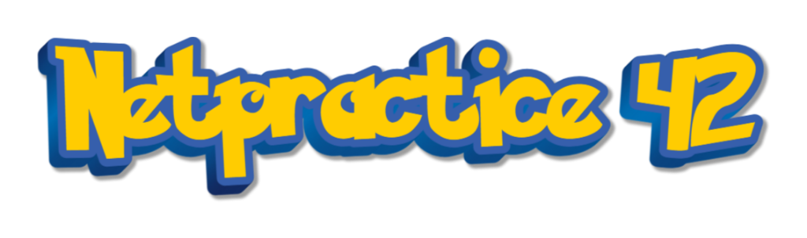

*This project has been created as part of the 42 curriculum by eduaserr.*

## 📖 Description

NetPractice is a hands-on networking exercise where you solve 10 levels of increasing difficulty. Each level presents a network diagram with devices that need to communicate with each other.

Your task is to configure IP addresses, subnet masks, and routing tables correctly so that all devices can reach their destinations. You'll work with hosts, routers, switches, and internet connections to build functional networks.

By completing this project, you'll learn the fundamentals of TCP/IP networking, including subnetting, gateways, and routing—essential skills for any system administrator or network engineer.

---

## 🚀 Instructions

### How to Run

1. **Download** the project files from the 42 intra subject page (`.tgz` archive).

   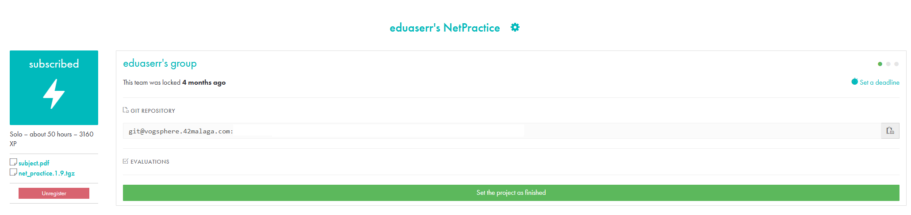

2. **Extract** the files using: `tar -xzf NetPractice.tgz`

3. **Launch** the training interface:
   ```bash
   ./run.sh
   ```
   Or open `index.html` directly in a web browser (Chrome and Opera supported).

4. **Select Training Mode**, enter your intra login, and click "Start!"

   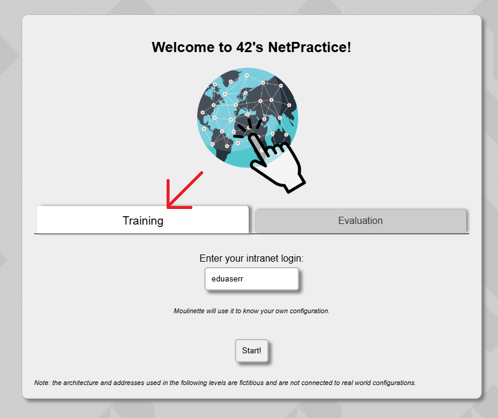

### Exporting Configurations

After successfully completing each level:
- Click the **"Get my config"** button to download your configuration as a JSON file.
- Each level generates a file named `level[X].json`.

### Submission Requirements

Your Git repository must contain:
- **10 configuration files** (one per level: `level1.json` to `level10.json`) at the root.
- This **README.md** file with complete documentation.

All configuration files must be valid and pass the training interface validation.

---

## 📚 Resources

### Networking Concepts Studied

This project covers essential networking concepts:
- **TCP/IP Addressing**: Understanding IPv4 addresses and their structure.
- **Subnet Masks**: Using CIDR notation (`/24`) and dotted decimal format (`255.255.255.0`).
- **Default Gateway**: Configuring the exit point for network traffic.
- **Routing Tables**: Managing routes to direct packets to their destinations.
- **Network Devices**:
  - **Switches**: Layer 2 devices that connect hosts within the same network.
  - **Routers**: Layer 3 devices that connect different networks and route traffic.
  - **Internet**: Simulated external network with specific routing constraints.
- **Subnetting**: Dividing networks into smaller subnetworks for efficient IP management.
- **OSI Model**: Focus on Layer 2 (Data Link) and Layer 3 (Network).

### Classic References

- [Subnet Calculator](https://www.subnet-calculator.com/)
- [TCP/IP Guide](http://www.tcpipguide.com/)
- [Cisco Networking Basics](https://www.cisco.com/c/en/us/solutions/small-business/resource-center/networking/networking-basics.html)
- [RFC 1918 - Private Address Space](https://tools.ietf.org/html/rfc1918)

### AI Usage

AI was used for:
- **Documentation**: Structuring and formatting the README.md file.
- **Concept Explanation**: Clarifying networking terminology and subnet calculations.
- **Validation**: Reviewing routing configurations and troubleshooting connectivity issues.

---

## 🎯 Level Breakdown

### LEVEL 01: Basic Host-to-Host Communication

**Objective**: Establish direct communication between two pairs of hosts.

**Goals**:
- Connect Host A with Host B
- Connect Host C with Host D

**Concepts Learned**:
- **IP Addresses**: Understanding the structure of IPv4 addresses.
- **Subnet Masks**: Ensuring devices in the same network share compatible IP ranges.
- **Network Matching**: Two hosts must be in the same subnet to communicate directly.

**Solution Approach**:
- Adjust IP addresses so that each pair shares the same network portion as defined by their subnet mask.
- For example: If Host A is `104.93.23.1/24`, Host B must be `104.93.23.X/24` (where X ≠ 1).

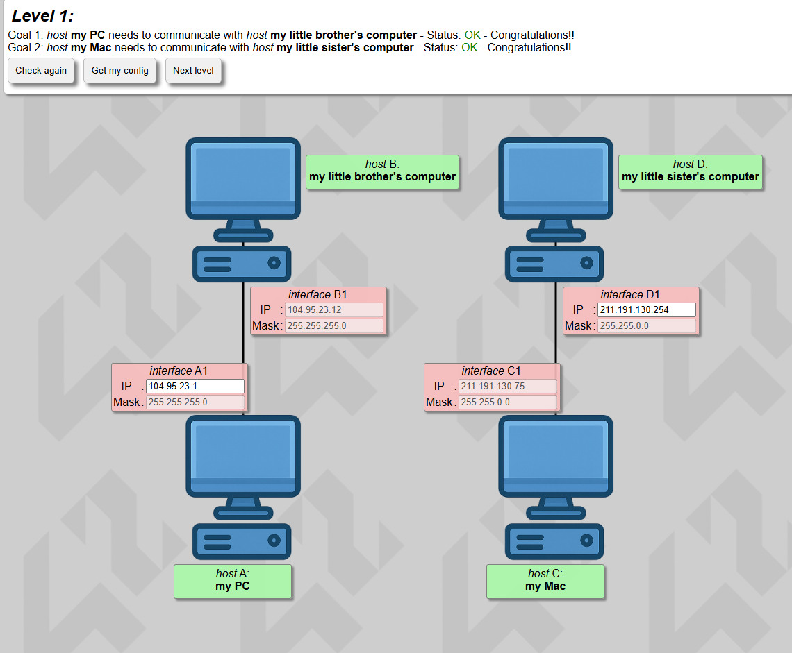

---

### LEVEL 02: CIDR Notation Introduction

**Objective**: Connect hosts using CIDR notation for subnet masks.

**Goals**:
- Enable communication between Computer A and Computer B
- Enable communication between Computer C and Computer D

**Concepts Learned**:
- **CIDR Format**: Understanding `/XX` notation (e.g., `/30` equals `255.255.255.252`).
- **Subnet Validation**: Correcting invalid subnet masks to valid CIDR values.
- **Network Boundaries**: Recognizing valid IP ranges within a given subnet.

**Solution Approach**:
- Convert invalid masks (like `255.255.255.32`) to valid CIDR masks (like `/27` = `255.255.255.224`).
- Ensure both hosts in a pair have compatible IPs within the same subnet range.

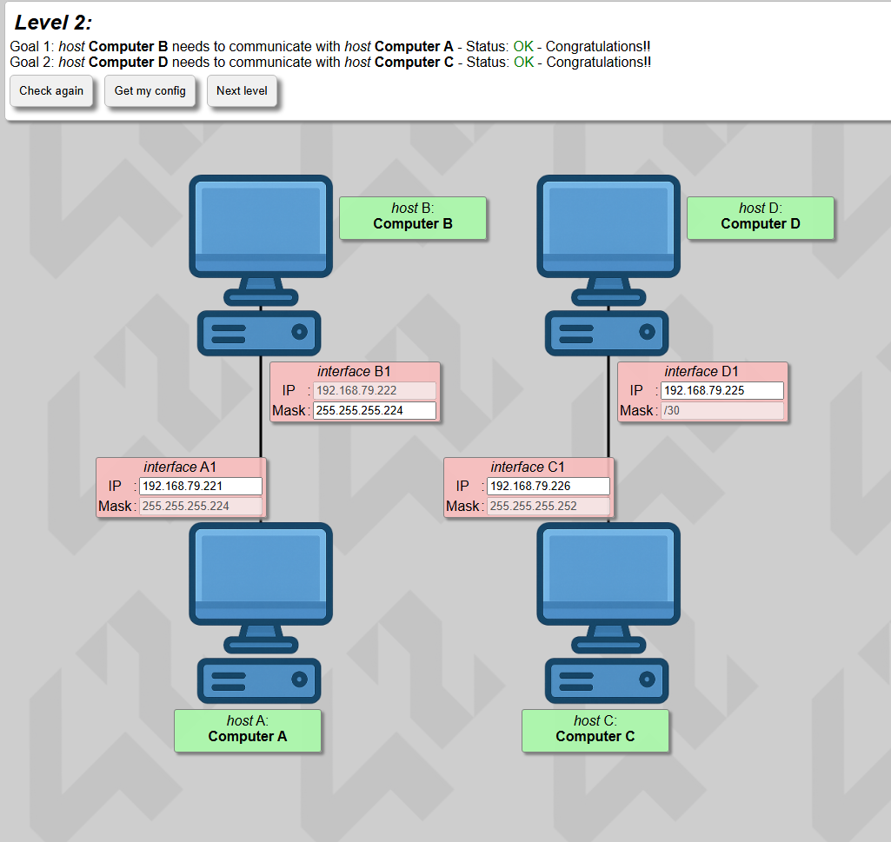

---

### LEVEL 03: Switch Configuration

**Objective**: Connect three hosts using a network switch.

**Goals**:
- Enable full connectivity: A ↔ B, A ↔ C, B ↔ C

**Concepts Learned**:
- **Switches**: Layer 2 devices that connect multiple hosts in the same network segment.
- **Broadcast Domain**: All devices connected to a switch must share the same subnet.
- **Consistent Masking**: Using uniform subnet masks across all connected devices for optimal performance.

**Solution Approach**:
- Configure all three hosts with IPs in the same network (e.g., `104.198.X.X/24`).
- Ensure no IP conflicts (each host must have a unique IP within the subnet).
- Adjust subnet masks to match across all interfaces.

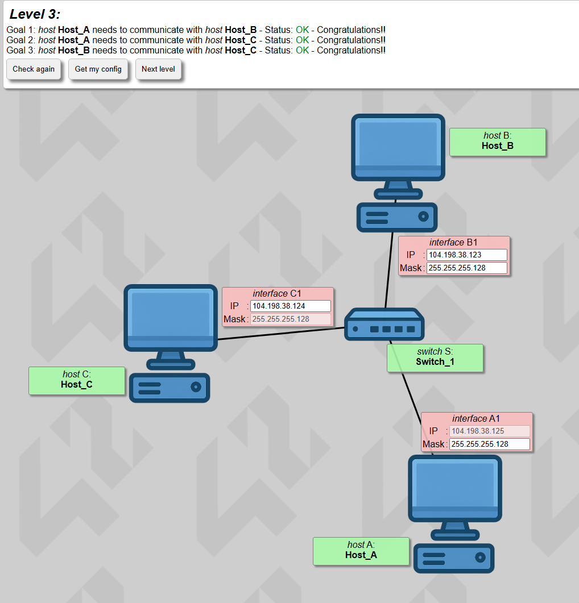

---

### LEVEL 04: Router Introduction

**Objective**: Connect hosts through a router with multiple interfaces.

**Goals**:
- Enable communication between Host A and Host B
- Enable all hosts to reach the router

**Concepts Learned**:
- **Routers**: Layer 3 devices that connect different networks.
- **Router Interfaces**: Each router interface belongs to a different network.
- **Gateway Configuration**: Hosts use router IPs as gateways to reach other networks.

**Solution Approach**:
- Configure router interfaces with appropriate IPs for each connected network.
- Ensure hosts in the same segment share the network portion of their IPs.
- Use consistent subnet masks for efficiency (e.g., `/24` or `/25`).

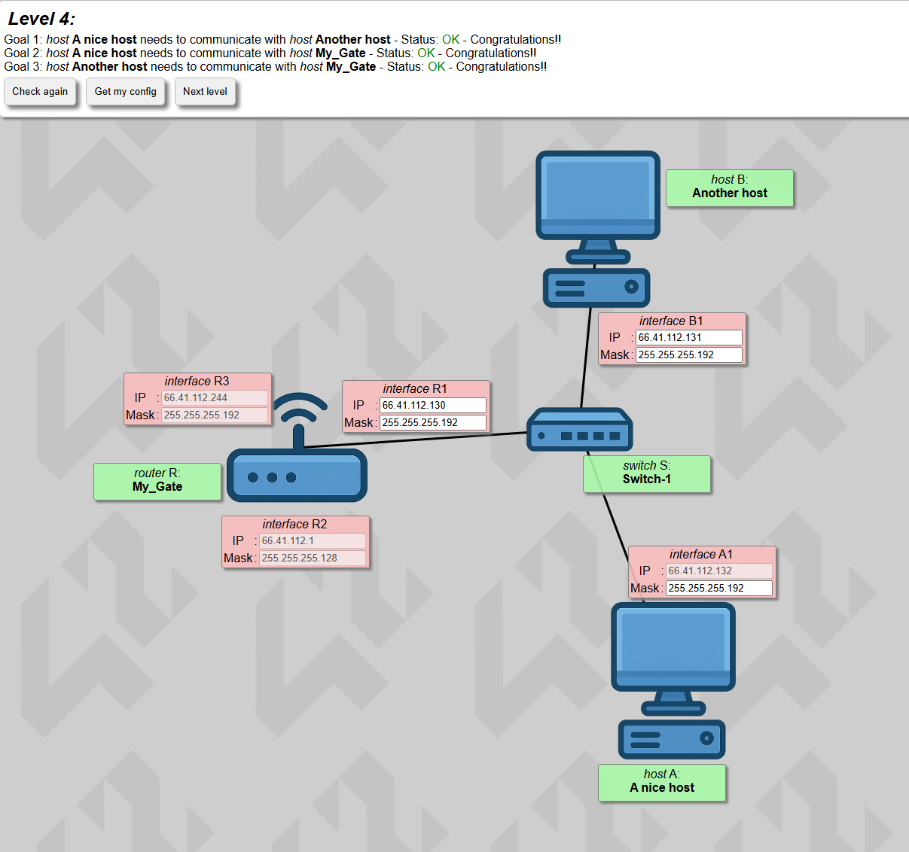

---

### LEVEL 05: Routing Tables

**Objective**: Configure host routing tables to enable cross-network communication.

**Goals**:
- Host A must reach the Router
- Host B must reach the Router
- Host A must reach Host B (through the Router)

**Concepts Learned**:
- **Routing Tables**: Defining where to send packets based on destination networks.
- **Default Route**: Using `0.0.0.0/0` or `default` when only one gateway exists.
- **Gateway IP**: The next-hop router interface that forwards traffic to the destination.

**Solution Approach**:
- Add default routes on hosts pointing to their respective router interfaces.
- Ensure the gateway IP matches the router's interface IP on the same subnet.
- Verify routing table entries direct traffic correctly.

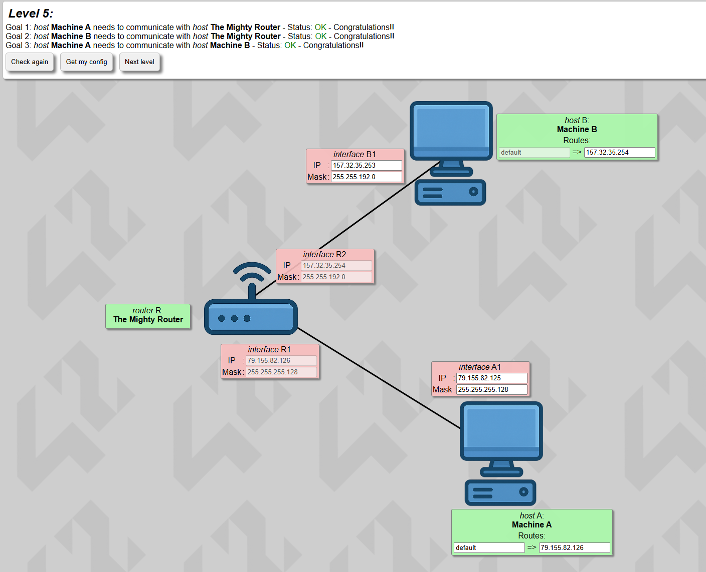

---

### LEVEL 06: Internet Connectivity

**Objective**: Configure a local network with internet access.

**Goals**:
- Host A must reach "Somewhere on the Net" (simulated internet destination)

**Concepts Learned**:
- **Internet Gateway**: Routers act as gateways to external networks.
- **Public vs Private IPs**: Understanding address space limitations.
- **Internet Routing**: Configuring routes on the Internet device to reach internal networks.

**Solution Approach**:
- Configure the host's default route to point to the router gateway.
- Set up the router's route to the internet gateway.
- Add a specific route on the Internet device to reach the internal network via the router's public interface.

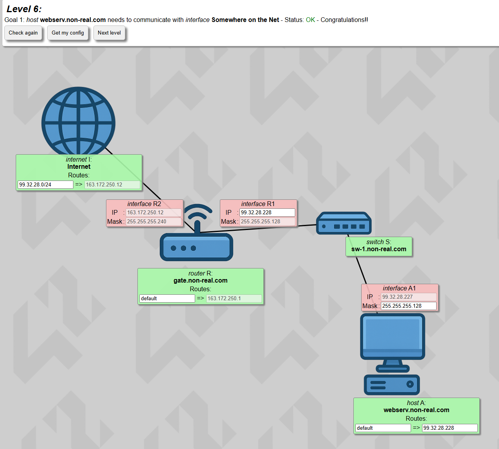

---

### LEVEL 07: Network Optimization

**Objective**: Design an optimized network where all IPs fit within specific subnet constraints.

**Goals**:
- Enable communication between Host A and Host C

**Concepts Learned**:
- **Subnet Planning**: Efficiently allocating IP ranges to minimize waste.
- **Multiple Subnets**: Using different subnet sizes for different network segments.
- **Route Aggregation**: Simplifying routing tables with proper subnet design.

**Solution Approach**:
- Calculate appropriate subnet masks for each network segment.
- Ensure all IPs fall within valid ranges for their respective subnets.
- Configure routing tables to enable inter-network communication.

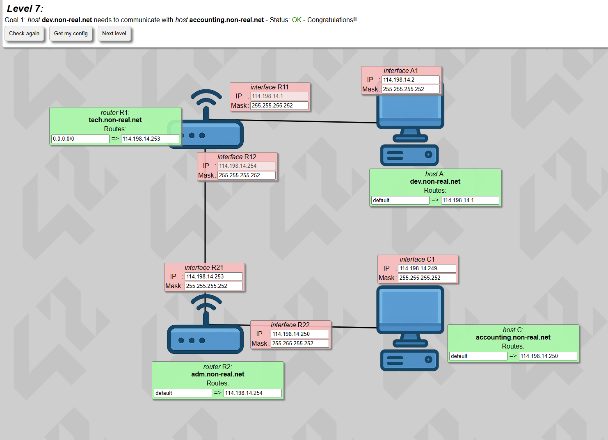

---

### LEVEL 08: Complex Routing

**Objective**: Manage multiple routes and create subnets within larger networks.

**Goals**:
- Host C must reach Host D
- Both hosts must reach "Somewhere on the Net"

**Concepts Learned**:
- **Multiple Routing Entries**: Managing several routes on a single device.
- **Route Priority**: Understanding that the first matching route is used.
- **Subnet Hierarchy**: Creating smaller subnets within larger network allocations.

**Solution Approach**:
- Configure specific routes before default routes in routing tables.
- Use appropriate subnet masks to define network boundaries clearly.
- Verify that gateway IPs are reachable from their source networks.

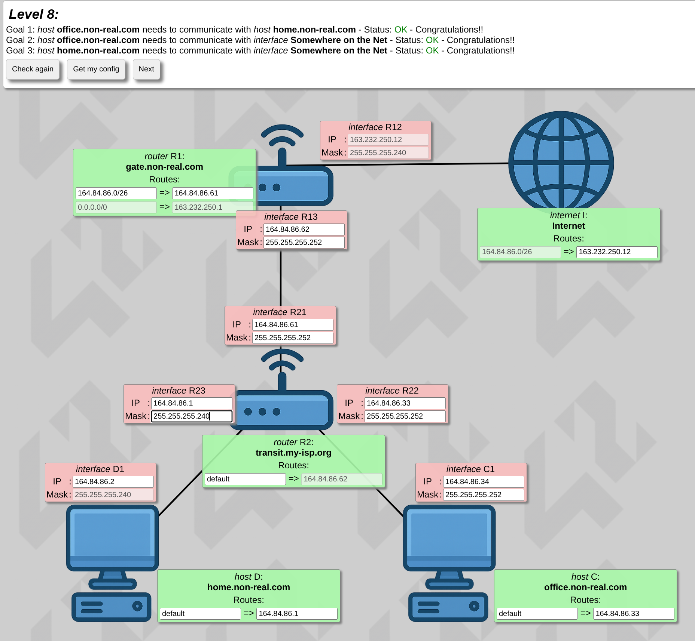

---

### LEVEL 09: Integration Challenge

**Objective**: Apply all previous concepts in a complex multi-router, multi-network scenario.

**Goals**:
- Enable full connectivity between 6 devices across multiple networks
- Ensure all hosts can reach each other and the internet

**Concepts Learned**:
- **Network Segmentation**: Dividing a large network into manageable subnets.
- **Multi-hop Routing**: Packets traversing multiple routers to reach destinations.
- **Routing Convergence**: Ensuring all routing tables work together cohesively.

**Solution Approach**:
- Map the entire network topology and identify all required routes.
- Configure each router's routing table with paths to all reachable networks.
- Test connectivity systematically between all device pairs.

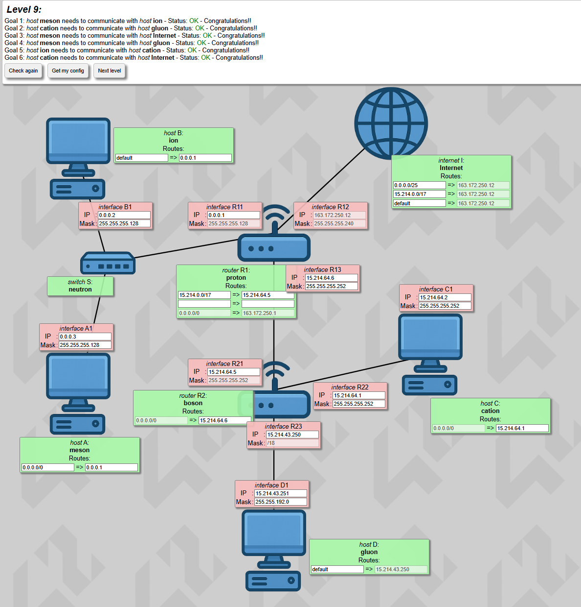

---

### LEVEL 10: Final Challenge

**Objective**: Master complex IP management and routing in a large-scale network.

**Goals**:
- Enable full connectivity between all 7 hosts
- Ensure internet reachability for all devices

**Concepts Learned**:
- **Advanced Subnetting**: Calculating precise subnet masks for efficient IP allocation.
- **Comprehensive Routing**: Building complete routing tables across multiple routers.
- **Network Troubleshooting**: Systematically identifying and resolving connectivity issues.

**Solution Approach**:
- Carefully plan IP address allocation across all network segments.
- Configure routing tables on all routers to enable complete connectivity.
- Verify each goal individually before validating the complete solution.

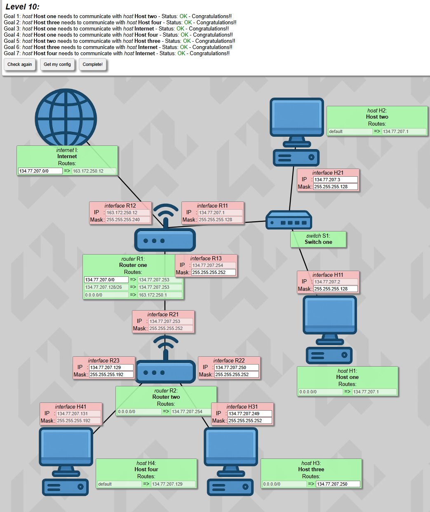

---

## 💡 Tips for Success

1. **Quick IP Range Calculation**: To check if two IPs share the same network (with same mask):
   - **Step 1**: Calculate block size → `256 - (last mask number)`
   - **Step 2**: Divide last IP number by block size, **ignore decimals**
   - **Step 3**: Multiply that whole number by block size = network start
   
   **Example**: Are `192.168.1.75/27` and `192.168.1.45/27` in the same network?
   - Mask `/27` = `255.255.255.224`
   - Block size: `256 - 224 = 32`
   - For IP ending in `.75`: `75 ÷ 32 = 2.34` → keep only **2** → `2 × 32 = 64`
   - For IP ending in `.45`: `45 ÷ 32 = 1.40` → keep only **1** → `1 × 32 = 32`
   - **Result**: Network starts at 64 vs 32 → **Different networks!**

2. **Subnet Calculators**: Use online tools to verify your calculations.
3. **Step-by-Step**: Test each connection individually before moving to complex scenarios.
4. **Route Specificity**: Remember that more specific routes (larger prefix) take precedence.
5. **IP Conflicts**: Ensure no two devices share the same IP address.
6. **Gateway Reachability**: The gateway IP must be in the same subnet as the source interface.

---

## ✅ Conclusion

NetPractice provides hands-on experience with fundamental networking concepts essential for system administration, network engineering, and cybersecurity. By completing all 10 levels, you'll have a solid foundation in TCP/IP networking and practical skills in configuring real-world network scenarios.

Good luck, and happy networking! 🌐
